<!--
/*************************************************************
 *   PROJECT : YERAYLOIS GITHUB PROFILE                      *
 *   FILE    : README.md                                     *
 *   PURPOSE : PUBLIC PROFILE OVERVIEW (ES/EN)               *
 *   AUTHOR  : Yeray Lois Sanchez                            *
 *   EMAIL   : yerayloissanchez@gmail.com                    *
 *************************************************************/
-->

<h1 align="center">𝐘𝐞𝐫𝐚𝐲 𝐋𝐨𝐢𝐬 𝐒𝐚́𝐧𝐜𝐡𝐞𝐳</h1>

<strong>𝐂𝐨𝐦𝐩𝐮𝐭𝐞𝐫 𝐄𝐧𝐠𝐢𝐧𝐞𝐞𝐫𝐢𝐧𝐠 𝐆𝐫𝐚𝐝𝐮𝐚𝐭𝐞 (𝟐𝟎𝟐𝟏-𝟐𝟎𝟐𝟓) @ 𝐔𝐃𝐂 · 𝐇𝐀𝐑𝐃𝐖𝐀𝐑𝐄</strong>

  <picture>
    <source media="(prefers-color-scheme: dark)" srcset="https://readme-typing-svg.demolab.com?font=Fira+Code&weight=600&pause=1400&center=true&vCenter=true&width=860&color=9BE9A8&lines=Embedded+Systems+%C2%B7+Automation+%C2%B7+Full-Stack;Building+reliable+developer+tooling+with+focus+on+execution" />
    <source media="(prefers-color-scheme: light)" srcset="https://readme-typing-svg.demolab.com?font=Fira+Code&weight=600&pause=1400&center=true&vCenter=true&width=860&color=36BCF7&lines=Embedded+Systems+%C2%B7+Automation+%C2%B7+Full-Stack;Building+reliable+developer+tooling+with+focus+on+execution" />
    
  </picture>

  
  
  

  
  

  <picture>
    <source media="(prefers-color-scheme: dark)" srcset="./assets/dividers/line-dark.svg" />
    <source media="(prefers-color-scheme: light)" srcset="./assets/dividers/line-light.svg" />
    
  </picture>

  

### 𝐒𝐎𝐁𝐑𝐄 𝐌𝐈

Graduado en Ingeniería Informática por la UDC (2021-2025), enfocado en sistemas embebidos, automatización y desarrollo de herramientas orientadas a ejecución real.

<h3 align="center">𝐌𝐄𝐓𝐑𝐈𝐂𝐀𝐒 𝐆𝐈𝐓𝐇𝐔𝐁</h3>

  <picture>
    <source media="(prefers-color-scheme: dark)" srcset="./assets/metrics/base.svg" />
    
  </picture>

### 𝐏𝐑𝐎𝐘𝐄𝐂𝐓𝐎 𝐒𝐄𝐌𝐀𝐍𝐀𝐋

  <picture>
    <source media="(prefers-color-scheme: dark)" srcset="./assets/spotlight/current-dark.svg" />
    <source media="(prefers-color-scheme: light)" srcset="./assets/spotlight/current-light.svg" />
    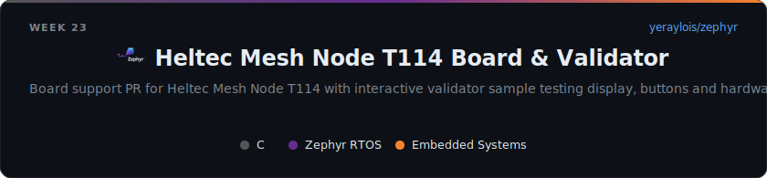
  </picture>

### 𝐒𝐍𝐀𝐊𝐄 𝐃𝐄 𝐂𝐎𝐍𝐓𝐑𝐈𝐁𝐔𝐂𝐈𝐎𝐍𝐄𝐒

<picture>
  <source media="(prefers-color-scheme: dark)" srcset="https://raw.githubusercontent.com/yeraylois/yeraylois/output/github-contribution-grid-snake-dark.svg" />
  <source media="(prefers-color-scheme: light)" srcset="https://raw.githubusercontent.com/yeraylois/yeraylois/output/github-contribution-grid-snake.svg" />
  
</picture>

### 𝐒𝐓𝐀𝐂𝐊 𝐓𝐄𝐂𝐍𝐎𝐋𝐎𝐆𝐈𝐂𝐎

  <picture>
    <source media="(prefers-color-scheme: dark)" srcset="./assets/stack/stack-dark-es.svg" />
    <source media="(prefers-color-scheme: light)" srcset="./assets/stack/stack-light-es.svg" />
    
  </picture>

### 𝐏𝐑𝐎𝐘𝐄𝐂𝐓𝐎𝐒 𝐃𝐄𝐒𝐓𝐀𝐂𝐀𝐃𝐎𝐒

  <a href="https://github.com/yeraylois/AII_2025_TT">
    <picture>
      <source media="(prefers-color-scheme: dark)" srcset="./assets/cards/project-aii_2025_tt-dark-es.svg" />
      <source media="(prefers-color-scheme: light)" srcset="./assets/cards/project-aii_2025_tt-light-es.svg" />
      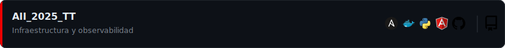
    </picture>
  </a>
   
  <a href="https://github.com/yeraylois/SE/tree/TraballoTutelado-2">
    <picture>
      <source media="(prefers-color-scheme: dark)" srcset="./assets/cards/project-se_tt2-dark-es.svg" />
      <source media="(prefers-color-scheme: light)" srcset="./assets/cards/project-se_tt2-light-es.svg" />
      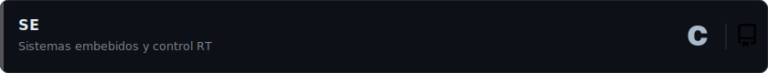
    </picture>
  </a>
   
  <a href="https://github.com/yeraylois/zephyr">
    <picture>
      <source media="(prefers-color-scheme: dark)" srcset="./assets/cards/project-zephyr_t114-dark-es.svg" />
      <source media="(prefers-color-scheme: light)" srcset="./assets/cards/project-zephyr_t114-light-es.svg" />
      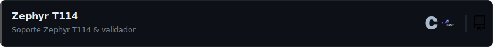
    </picture>
  </a>

### 𝐂𝐎𝐍𝐓𝐀𝐂𝐓𝐎

  <a href="mailto:yerayloissanchez@gmail.com">
    <picture>
      <source media="(prefers-color-scheme: dark)" srcset="./assets/cards/contact-email-dark-es.svg" />
      <source media="(prefers-color-scheme: light)" srcset="./assets/cards/contact-email-light-es.svg" />
      
    </picture>
  </a>
   
  <a href="https://www.linkedin.com/in/yeray-lois">
    <picture>
      <source media="(prefers-color-scheme: dark)" srcset="./assets/cards/contact-linkedin-dark-es.svg" />
      <source media="(prefers-color-scheme: light)" srcset="./assets/cards/contact-linkedin-light-es.svg" />
      
    </picture>
  </a>
   
  <a href="https://github.com/yeraylois">
    <picture>
      <source media="(prefers-color-scheme: dark)" srcset="./assets/cards/contact-github-dark-es.svg" />
      <source media="(prefers-color-scheme: light)" srcset="./assets/cards/contact-github-light-es.svg" />
      
    </picture>
  </a>

  <picture>
    <source media="(prefers-color-scheme: dark)" srcset="./assets/dividers/line-dark.svg" />
    <source media="(prefers-color-scheme: light)" srcset="./assets/dividers/line-light.svg" />
    
  </picture>

  

### 𝐀𝐁𝐎𝐔𝐓 𝐌𝐄

Computer Engineering graduate from UDC (2021-2025), focused on embedded systems, automation and execution-oriented developer tooling.

<h3 align="center">𝐆𝐈𝐓𝐇𝐔𝐁 𝐌𝐄𝐓𝐑𝐈𝐂𝐒</h3>

  <picture>
    <source media="(prefers-color-scheme: dark)" srcset="./assets/metrics/base.svg" />
    
  </picture>

### 𝐖𝐄𝐄𝐊𝐋𝐘 𝐏𝐑𝐎𝐉𝐄𝐂𝐓 𝐒𝐏𝐎𝐓𝐋𝐈𝐆𝐇𝐓

  <picture>
    <source media="(prefers-color-scheme: dark)" srcset="./assets/spotlight/current-dark.svg" />
    <source media="(prefers-color-scheme: light)" srcset="./assets/spotlight/current-light.svg" />
    
  </picture>

### 𝐂𝐎𝐍𝐓𝐑𝐈𝐁𝐔𝐓𝐈𝐎𝐍 𝐒𝐍𝐀𝐊𝐄

<picture>
  <source media="(prefers-color-scheme: dark)" srcset="https://raw.githubusercontent.com/yeraylois/yeraylois/output/github-contribution-grid-snake-dark.svg" />
  <source media="(prefers-color-scheme: light)" srcset="https://raw.githubusercontent.com/yeraylois/yeraylois/output/github-contribution-grid-snake.svg" />
  
</picture>

### 𝐓𝐄𝐂𝐇 𝐒𝐓𝐀𝐂𝐊

  <picture>
    <source media="(prefers-color-scheme: dark)" srcset="./assets/stack/stack-dark-en.svg" />
    <source media="(prefers-color-scheme: light)" srcset="./assets/stack/stack-light-en.svg" />
    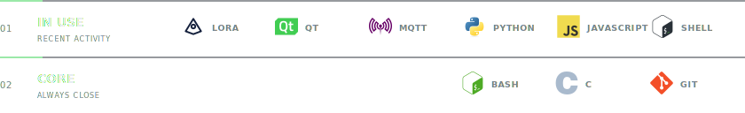
  </picture>

### 𝐅𝐄𝐀𝐓𝐔𝐑𝐄𝐃 𝐏𝐑𝐎𝐉𝐄𝐂𝐓𝐒

  <a href="https://github.com/yeraylois/AII_2025_TT">
    <picture>
      <source media="(prefers-color-scheme: dark)" srcset="./assets/cards/project-aii_2025_tt-dark-en.svg" />
      <source media="(prefers-color-scheme: light)" srcset="./assets/cards/project-aii_2025_tt-light-en.svg" />
      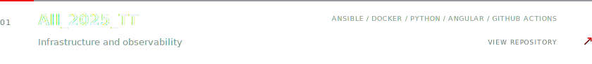
    </picture>
  </a>
   
  <a href="https://github.com/yeraylois/SE/tree/TraballoTutelado-2">
    <picture>
      <source media="(prefers-color-scheme: dark)" srcset="./assets/cards/project-se_tt2-dark-en.svg" />
      <source media="(prefers-color-scheme: light)" srcset="./assets/cards/project-se_tt2-light-en.svg" />
      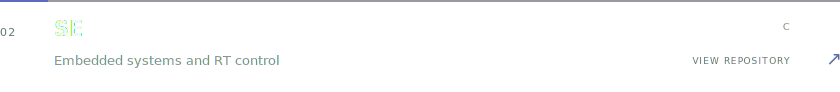
    </picture>
  </a>
   
  <a href="https://github.com/yeraylois/zephyr">
    <picture>
      <source media="(prefers-color-scheme: dark)" srcset="./assets/cards/project-zephyr_t114-dark-en.svg" />
      <source media="(prefers-color-scheme: light)" srcset="./assets/cards/project-zephyr_t114-light-en.svg" />
      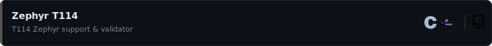
    </picture>
  </a>

### 𝐂𝐎𝐍𝐓𝐀𝐂𝐓

  <a href="mailto:yerayloissanchez@gmail.com">
    <picture>
      <source media="(prefers-color-scheme: dark)" srcset="./assets/cards/contact-email-dark-en.svg" />
      <source media="(prefers-color-scheme: light)" srcset="./assets/cards/contact-email-light-en.svg" />
      
    </picture>
  </a>
   
  <a href="https://www.linkedin.com/in/yeray-lois">
    <picture>
      <source media="(prefers-color-scheme: dark)" srcset="./assets/cards/contact-linkedin-dark-en.svg" />
      <source media="(prefers-color-scheme: light)" srcset="./assets/cards/contact-linkedin-light-en.svg" />
      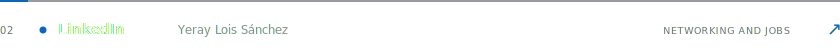
    </picture>
  </a>
   
  <a href="https://github.com/yeraylois">
    <picture>
      <source media="(prefers-color-scheme: dark)" srcset="./assets/cards/contact-github-dark-en.svg" />
      <source media="(prefers-color-scheme: light)" srcset="./assets/cards/contact-github-light-en.svg" />
      
    </picture>
  </a>

  <picture>
    <source media="(prefers-color-scheme: dark)" srcset="./assets/footer/footer-dark.svg" />
    <source media="(prefers-color-scheme: light)" srcset="./assets/footer/footer-light.svg" />
    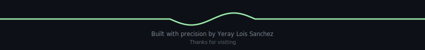
  </picture>

