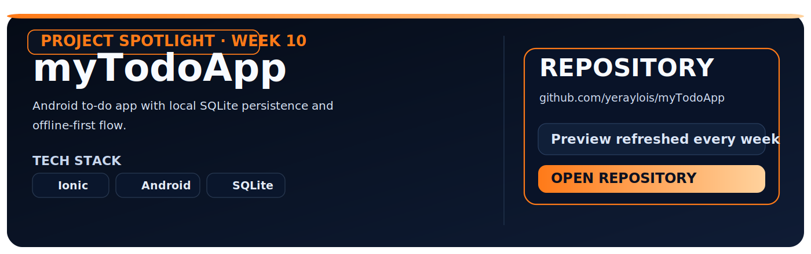

<!--
/*************************************************************
 *   PROJECT : YERAYLOIS GITHUB PROFILE                      *
 *   FILE    : README.md                                     *
 *   PURPOSE : PUBLIC PROFILE OVERVIEW (ES/EN)               *
 *   AUTHOR  : Yeray Lois Sanchez                            *
 *   EMAIL   : yeray.lois@udc.es                             *
 *************************************************************/
-->

<h1 align="center">Yeray Lois Sánchez</h1>

<strong>Computer Engineering Graduate (2021-2025) @ UDC</strong> · Hardware & Computation

  

  
  
  

  <a href="#espanol"><strong>ESPAÑOL</strong></a> · <a href="#english"><strong>ENGLISH</strong></a>

---

## ESPAÑOL

### SOBRE MÍ

Graduado en Ingeniería Informática por la UDC (promoción 2021-2025), con foco en sistemas embebidos, automatización y desarrollo de herramientas técnicas orientadas a ejecución real.

### STACK PRINCIPAL

  
  
  
  
  
  
  
  
  

### DESTACADOS

- Participación en **HackUPC 2025** con [SkyBuddies](https://github.com/DiegoRS05/SkyBuddies).
- Proyectos en firmware, automatización DevOps y desarrollo full-stack.

<h3 align="center">MÉTRICAS GITHUB</h3>

  <picture>
    <source media="(prefers-color-scheme: dark)" srcset="./assets/metrics/base.svg" />
    
  </picture>

### PROJECT SPOTLIGHT SEMANAL

  

### SNAKE DE CONTRIBUCIONES

<picture>
  <source media="(prefers-color-scheme: dark)" srcset="https://raw.githubusercontent.com/yeraylois/yeraylois/output/github-contribution-grid-snake-dark.svg" />
  <source media="(prefers-color-scheme: light)" srcset="https://raw.githubusercontent.com/yeraylois/yeraylois/output/github-contribution-grid-snake.svg" />
  
</picture>

### PROYECTOS DESTACADOS

<table align="center" width="98%">
  <tr>
    <th width="16%">PROYECTO</th>
    <th width="42%">DESCRIPCIÓN</th>
    <th width="24%">STACK</th>
    <th width="18%">ENLACE</th>
  </tr>
  <tr>
    <td><code>myTodoApp</code></td>
    <td>App Android de tareas con persistencia local</td>
    <td>Ionic, Android, SQLite</td>
    <td><a href="https://github.com/yeraylois/myTodoApp">📦&nbsp;Repo</a></td>
  </tr>
  <tr>
    <td><code>AII_2025_TT</code></td>
    <td>Automatización de infraestructura y observabilidad</td>
    <td>Ansible, Docker, Python, Angular, GitHub Actions, Prometheus, Grafana</td>
    <td><a href="https://github.com/yeraylois/AII_2025_TT">📦&nbsp;Repo</a></td>
  </tr>
  <tr>
    <td><code>SE</code></td>
    <td>Proyecto de sistemas embebidos y control en tiempo real</td>
    <td>C, Microcontroladores</td>
    <td><a href="https://github.com/yeraylois/SE/tree/TraballoTutelado-2">📦&nbsp;Repo</a></td>
  </tr>
</table>

### CONTACTO

  
  
  

<table align="center" width="98%">
  <tr>
    <th width="16%">CANAL</th>
    <th width="42%">ENLACE</th>
    <th width="24%">USO RECOMENDADO</th>
    <th width="18%">ACCIÓN</th>
  </tr>
  <tr>
    <td><strong>Email</strong></td>
    <td><a href="mailto:yeray.lois@udc.es">yeray.lois@udc.es</a></td>
    <td>Colaboraciones</td>
    <td><a href="mailto:yeray.lois@udc.es">✉️&nbsp;Escribir</a></td>
  </tr>
  <tr>
    <td><strong>LinkedIn</strong></td>
    <td><a href="https://www.linkedin.com/in/yeray-lois-sánchez-6a4305363/">linkedin.com/in/yeraylois</a></td>
    <td>Networking</td>
    <td><a href="https://www.linkedin.com/in/yeray-lois-sánchez-6a4305363/">🔗&nbsp;Conectar</a></td>
  </tr>
  <tr>
    <td><strong>GitHub</strong></td>
    <td><a href="https://github.com/yeraylois">github.com/yeraylois</a></td>
    <td>Código público</td>
    <td><a href="https://github.com/yeraylois">💻&nbsp;Ver perfil</a></td>
  </tr>
</table>

---

## ENGLISH

### ABOUT ME

Computer Engineering graduate from UDC (Class of 2021-2025), focused on embedded systems, automation and execution-oriented developer tooling.

### MAIN STACK

  
  
  
  
  
  
  
  
  

### HIGHLIGHTS

- **HackUPC 2025** participant with [SkyBuddies](https://github.com/DiegoRS05/SkyBuddies).
- Projects across firmware, DevOps automation and full-stack development.

<h3 align="center">GITHUB METRICS</h3>

  <picture>
    <source media="(prefers-color-scheme: dark)" srcset="./assets/metrics/base.svg" />
    
  </picture>

### WEEKLY PROJECT SPOTLIGHT

  

### CONTRIBUTION SNAKE

<picture>
  <source media="(prefers-color-scheme: dark)" srcset="https://raw.githubusercontent.com/yeraylois/yeraylois/output/github-contribution-grid-snake-dark.svg" />
  <source media="(prefers-color-scheme: light)" srcset="https://raw.githubusercontent.com/yeraylois/yeraylois/output/github-contribution-grid-snake.svg" />
  
</picture>

### FEATURED PROJECTS

<table align="center" width="98%">
  <tr>
    <th width="16%">PROJECT</th>
    <th width="42%">DESCRIPTION</th>
    <th width="24%">STACK</th>
    <th width="18%">LINK</th>
  </tr>
  <tr>
    <td><code>myTodoApp</code></td>
    <td>Android task app with local persistence</td>
    <td>Ionic, Android, SQLite</td>
    <td><a href="https://github.com/yeraylois/myTodoApp">📦&nbsp;Repo</a></td>
  </tr>
  <tr>
    <td><code>AII_2025_TT</code></td>
    <td>Infrastructure automation and observability</td>
    <td>Ansible, Docker, Python, Angular, GitHub Actions, Prometheus, Grafana</td>
    <td><a href="https://github.com/yeraylois/AII_2025_TT">📦&nbsp;Repo</a></td>
  </tr>
  <tr>
    <td><code>SE</code></td>
    <td>Embedded systems and real-time control project</td>
    <td>C, Microcontrollers</td>
    <td><a href="https://github.com/yeraylois/SE/tree/TraballoTutelado-2">📦&nbsp;Repo</a></td>
  </tr>
</table>

### CONTACT

  
  
  

<table align="center" width="98%">
  <tr>
    <th width="16%">CHANNEL</th>
    <th width="42%">LINK</th>
    <th width="24%">BEST FOR</th>
    <th width="18%">ACTION</th>
  </tr>
  <tr>
    <td><strong>Email</strong></td>
    <td><a href="mailto:yeray.lois@udc.es">yeray.lois@udc.es</a></td>
    <td>Collaboration</td>
    <td><a href="mailto:yeray.lois@udc.es">✉️&nbsp;Contact</a></td>
  </tr>
  <tr>
    <td><strong>LinkedIn</strong></td>
    <td><a href="https://www.linkedin.com/in/yeray-lois-sánchez-6a4305363/">linkedin.com/in/yeraylois</a></td>
    <td>Networking</td>
    <td><a href="https://www.linkedin.com/in/yeray-lois-sánchez-6a4305363/">🔗&nbsp;Connect</a></td>
  </tr>
  <tr>
    <td><strong>GitHub</strong></td>
    <td><a href="https://github.com/yeraylois">github.com/yeraylois</a></td>
    <td>Public code</td>
    <td><a href="https://github.com/yeraylois">💻&nbsp;View profile</a></td>
  </tr>
</table>
