<h1 align="center">Yeray Lois Sánchez</h1>

<strong>Computer Engineering Graduate (2021-2025) @ UDC</strong> · Hardware & Computation

  

  
  
  

  <a href="#espanol"><strong>ESPAÑOL</strong></a> · <a href="#english-version"><strong>ENGLISH</strong></a>

---

## ESPAÑOL

### SOBRE MÍ

Graduado en Ingeniería Informática por la UDC (promoción 2021-2025), con foco en sistemas embebidos, automatización y desarrollo de herramientas técnicas orientadas a ejecución real.

### STACK PRINCIPAL

  
  
  
  
  
  
  
  
  

### DESTACADOS

- Ganador de challenge en **Hack UDC 2025** con *SolutionHub*.
- Participación en **HackUPC 2025** con [SkyBuddies](https://github.com/DiegoRS05/SkyBuddies).
- Proyectos en firmware, automatización DevOps y desarrollo full-stack.

<h3 align="center">MÉTRICAS GITHUB</h3>

  <picture>
    <source media="(prefers-color-scheme: dark)" srcset="./assets/metrics/base.dark.svg" />
    
  </picture>

  <picture>
    <source media="(prefers-color-scheme: dark)" srcset="./assets/metrics/languages.dark.svg" />
    
  </picture>

### SNAKE DE CONTRIBUCIONES

<picture>
  <source media="(prefers-color-scheme: dark)" srcset="https://raw.githubusercontent.com/yeraylois/yeraylois/output/github-contribution-grid-snake-dark.svg" />
  <source media="(prefers-color-scheme: light)" srcset="https://raw.githubusercontent.com/yeraylois/yeraylois/output/github-contribution-grid-snake.svg" />
  
</picture>

### PROYECTOS DESTACADOS

| PROYECTO | DESCRIPCIÓN | STACK | ENLACE |
|---|---|---|---|
| `myTodoApp` | App Android de tareas con persistencia local | Ionic, Android, SQLite | [Repo](https://github.com/yeraylois/myTodoApp) |
| `AII_2025_TT` | Automatización de infraestructura y observabilidad | Ansible, Docker, Python, Angular, GitHub Actions, Prometheus, Grafana | [Repo](https://github.com/yeraylois/AII_2025_TT) |
| `SE` | Proyecto de sistemas embebidos y control en tiempo real | C, Microcontroladores | [Repo](https://github.com/yeraylois/SE/tree/TraballoTutelado-2) |

### CONTACTO

  
  
  

| CANAL | ENLACE | USO RECOMENDADO |
|---|---|---|
| Email | [yeray.lois@udc.es](mailto:yeray.lois@udc.es) | Contacto profesional y colaboraciones |
| LinkedIn | [linkedin.com/in/yeray-lois-sánchez-6a4305363](https://www.linkedin.com/in/yeray-lois-sánchez-6a4305363/) | Networking y oportunidades profesionales |
| GitHub | [github.com/yeraylois](https://github.com/yeraylois) | Código, proyectos y actividad técnica |

---

  
<strong>ENGLISH VERSION (CLICK TO EXPAND)</strong>

   

### ABOUT ME

Computer Engineering graduate from UDC (Class of 2021-2025), focused on embedded systems, automation and execution-oriented developer tooling.

### MAIN STACK

C · Python · Java · Kotlin · Angular · Docker · Linux · Bash · Git

### HIGHLIGHTS

- Challenge winner at **Hack UDC 2025** with *SolutionHub*.
- **HackUPC 2025** participant with [SkyBuddies](https://github.com/DiegoRS05/SkyBuddies).
- Projects across firmware, DevOps automation and full-stack development.

<h3 align="center">GITHUB METRICS</h3>

  <picture>
    <source media="(prefers-color-scheme: dark)" srcset="./assets/metrics/base.dark.svg" />
    
  </picture>

  <picture>
    <source media="(prefers-color-scheme: dark)" srcset="./assets/metrics/languages.dark.svg" />
    
  </picture>

### CONTACT

| CHANNEL | LINK |
|---|---|
| Email | [yeray.lois@udc.es](mailto:yeray.lois@udc.es) |
| LinkedIn | [yeraylois](https://www.linkedin.com/in/yeray-lois-sánchez-6a4305363/) |
| GitHub | [@yeraylois](https://github.com/yeraylois) |

